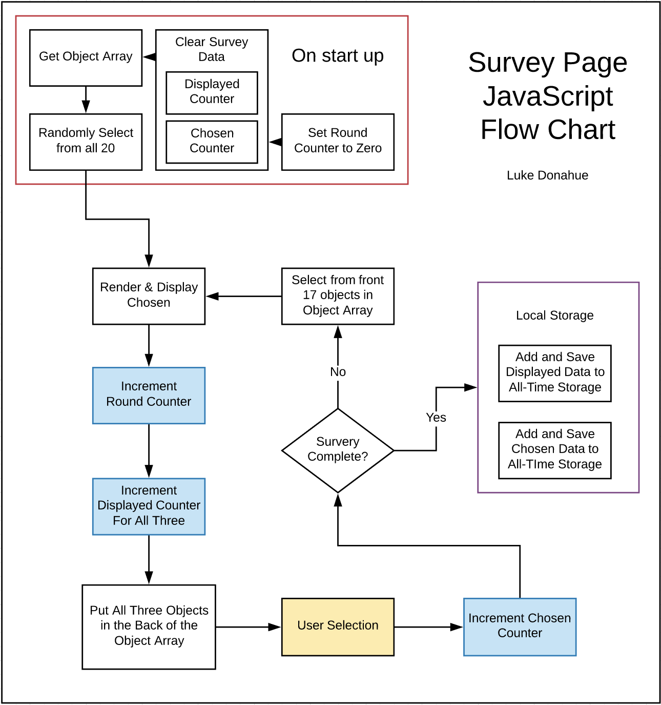

1. What pages will need to be created?

    We will need two pages. One will double as the survey start, and survey page. The other will show results for both the previous round, and all time. 
    
1. What data will need to be saved, updated, and when?

    We need to save which images were presented, and which image was chosen after the user selection on each round. 

    There should also be two running tallies, one for the current run, and one for the all-time results. These count as updates, not saves. 

1. What data will need to be retrieved and when?
    
    We will need to access the array of images every round. The three objects in the previous round will be moved to the end of the array, and the three new items will be selected from the front seventeen. 

1. What rules exists and what algorithms (flow charts) need to be defined?
    
    There is already a .move method for the arrays. I will need to make get and save methods for my array of objects. I'll also need to come up with a number generator that chooses 3 random numbers between 1 and 17. 

